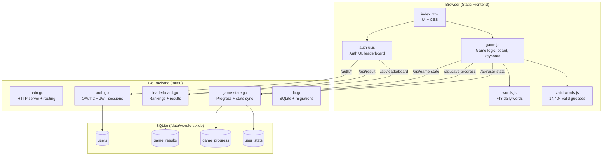
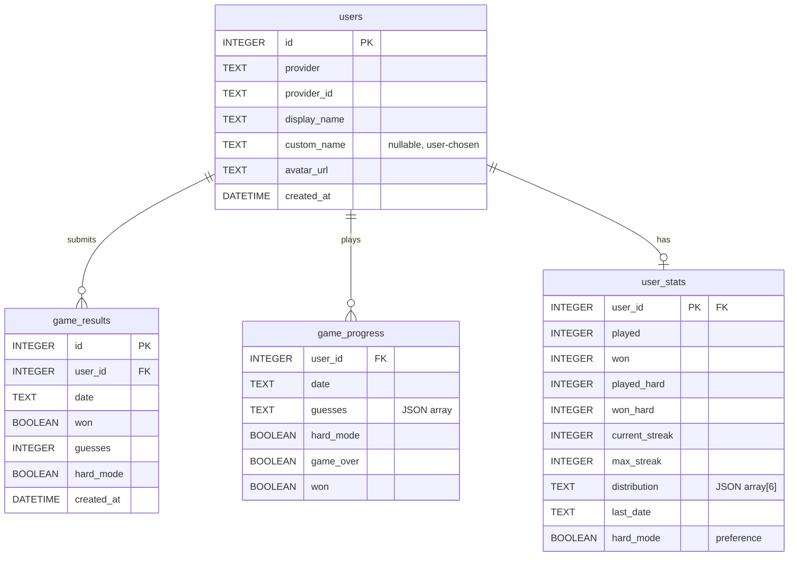
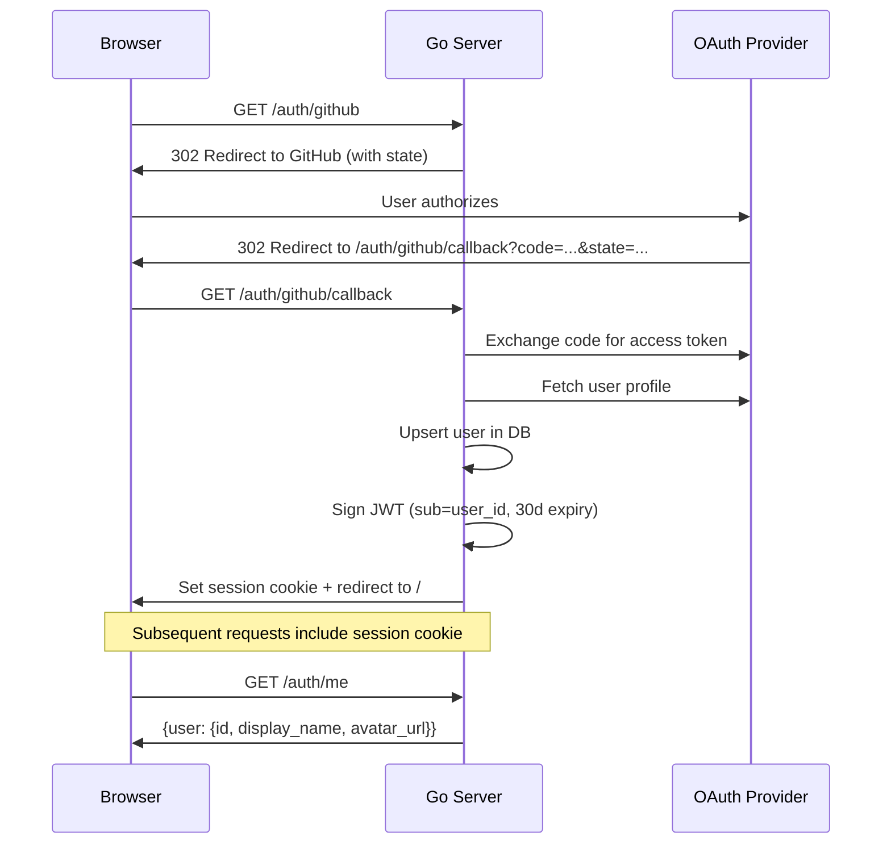
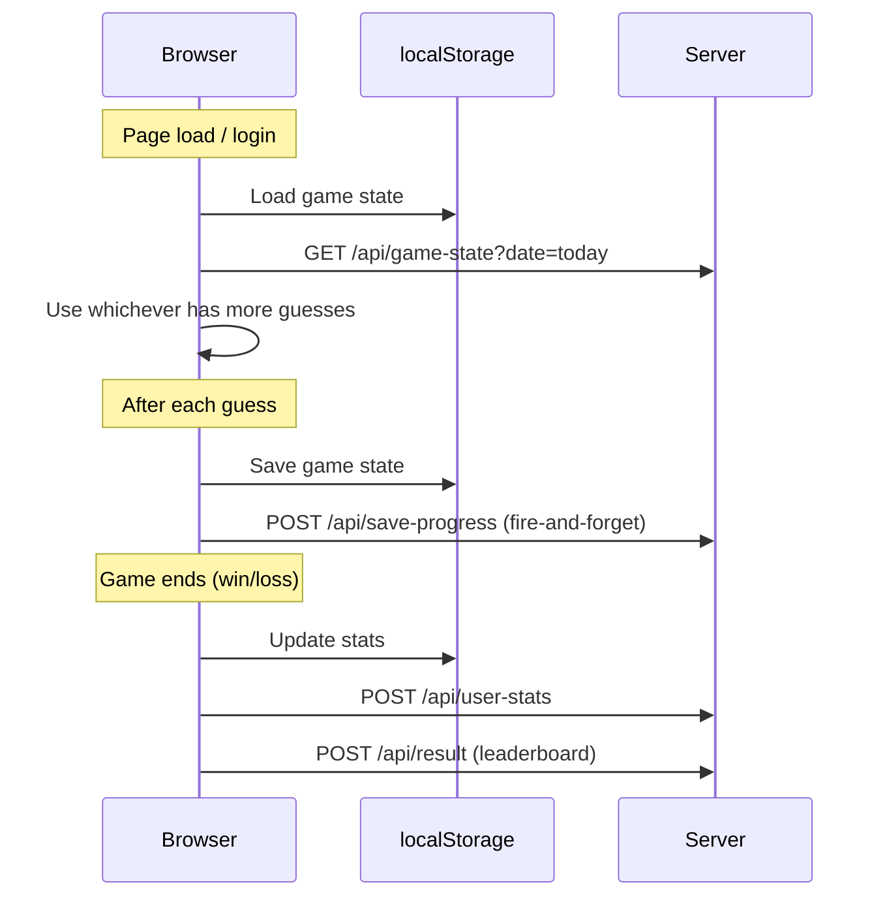

# Wordle Six

A daily 6-letter word puzzle game with OAuth authentication, server-side game state sync, competitive leaderboard, and hard mode.

**Live:** https://wordle-six.tomtom.fyi

## Architecture



## Features

- **Daily Challenge** — New word every day at midnight, deterministic (same word for everyone)
- **Cross-Device Sync** — Sign in to resume games and stats on any browser
- **OAuth Authentication** — GitHub, Discord, and Google sign-in
- **Competitive Leaderboard** — Weighted average ranking with hard mode bonus
- **Hard Mode** — Can be toggled mid-game if all prior guesses comply
- **Stats Tracking** — Games played, won, streaks, guess distribution (with hard mode breakdown)
- **Offline Ready** — Full word dictionary bundled client-side, no API needed for validation
- **PWA** — Installable on mobile via manifest
- **Mobile Optimized** — Responsive layout with touch-friendly keyboard

## Tech Stack

| Layer | Technology |
|-------|-----------|
| Backend | Go 1.23, `net/http` (stdlib router) |
| Database | SQLite with WAL mode (`github.com/mattn/go-sqlite3`) |
| Auth | OAuth2 (manual flow) + JWT sessions (`github.com/golang-jwt/jwt/v5`) |
| Frontend | Vanilla HTML/CSS/JavaScript (no framework, no build step) |
| Fonts | Cormorant Garamond + DM Sans (Google Fonts) |
| Deployment | Docker multi-stage build via vibe-deploy |

## Database Schema



### Table Purposes

- **`users`** — OAuth identity. Unique on `(provider, provider_id)`. Upserted on each login.
- **`game_results`** — Final outcomes only (win/loss + guess count). Powers the leaderboard. Unique on `(user_id, date)`, insert-once (no updates).
- **`game_progress`** — Live game state. Upserted after every guess. Enables cross-device resume.
- **`user_stats`** — Cumulative stats and preferences. Updated after each game completion and hard mode toggle.

## Authentication Flow



Sessions are JWT-based with a 30-day expiry stored in an HttpOnly, SameSite=Lax cookie.

### Custom Display Names

On first login (`is_new` flag), a welcome modal prompts the user to choose a display name (1-20 characters). This is stored as `custom_name` in the `users` table and used on the leaderboard via `COALESCE(custom_name, display_name)`. Users can change their name later from the settings modal.

## Game State Sync



Logged-out users fall back to localStorage only. Signing in merges server state (server wins when it has more guesses).

## Word Library

- **Daily words** (`words.js`) — 743 curated 6-letter words. No plurals, all common/recognizable. A seeded PRNG based on the date selects one per day, so everyone gets the same word.
- **Valid guesses** (`valid-words.js`) — 14,404 accepted 6-letter words. Validated client-side with a `Set` for instant feedback. No network round-trip needed.

## Hard Mode

Hard mode requires all revealed hints to be used in subsequent guesses:
- Green letters must stay in their exact position
- Yellow letters must appear somewhere (but not in the excluded position)
- Grey letters cannot be reused

**Mid-game toggle:** Unlike standard Wordle, hard mode can be enabled mid-game as long as all prior guesses would have been valid under hard mode rules. The `canEnableHardMode()` function replays each guess through the constraint checker to verify this.

## Leaderboard

Rankings use a weighted average: `avg_guesses * (1 - 0.1 * has_hard_mode_wins)`. Hard mode wins receive a 10% bonus. Top 3 players receive gold, silver, and bronze trophy icons. A compact top-3 display appears below the game board, with a full scrollable leaderboard in a modal (default limit 50, max 100).

## API Routes

| Method | Path | Auth | Description |
|--------|------|------|-------------|
| GET | `/auth/{provider}` | No | Start OAuth flow |
| GET | `/auth/{provider}/callback` | No | OAuth callback |
| GET | `/auth/me` | Yes | Current user info + `is_new` flag |
| POST | `/auth/logout` | Yes | Clear session |
| GET | `/api/game-state?date=` | Yes | Get saved game progress |
| POST | `/api/save-progress` | Yes | Upsert game progress |
| GET | `/api/user-stats` | Yes | Get user stats + preferences |
| POST | `/api/user-stats` | Yes | Save user stats + preferences |
| POST | `/api/display-name` | Yes | Set custom display name (1-20 chars) |
| POST | `/api/result` | Yes | Submit final game result |
| GET | `/api/leaderboard?limit=` | No | Get ranked leaderboard |

## Deployment

Dockerized multi-stage build (Go 1.23-alpine builder, alpine 3.20 runtime). Deployed via vibe-deploy webhook on push to `main`. SQLite database persisted in a Docker volume (`wordle-six-data:/data`).

```
wordle-six.tomtom.fyi → Cloudflare Tunnel → Caddy → wordle-six:8080
```
